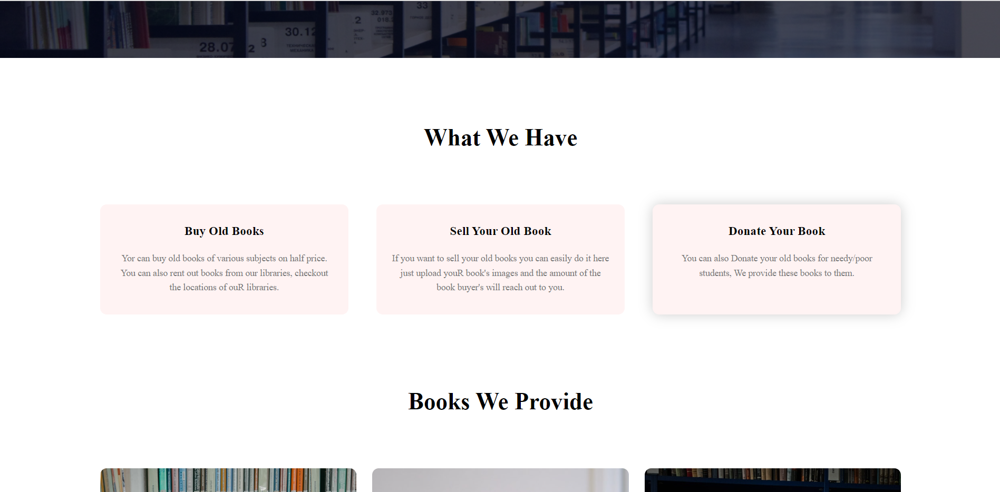
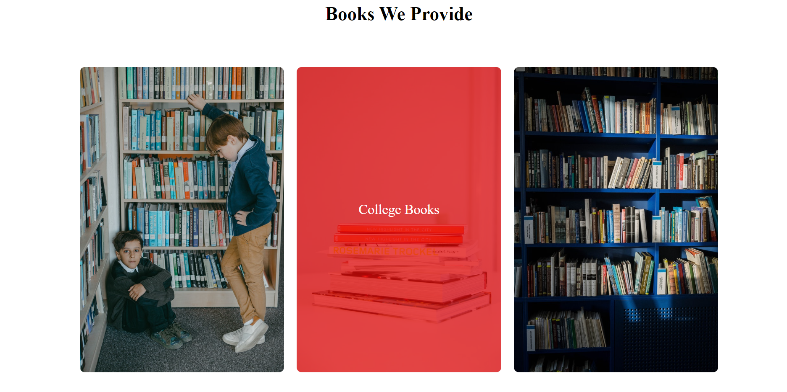
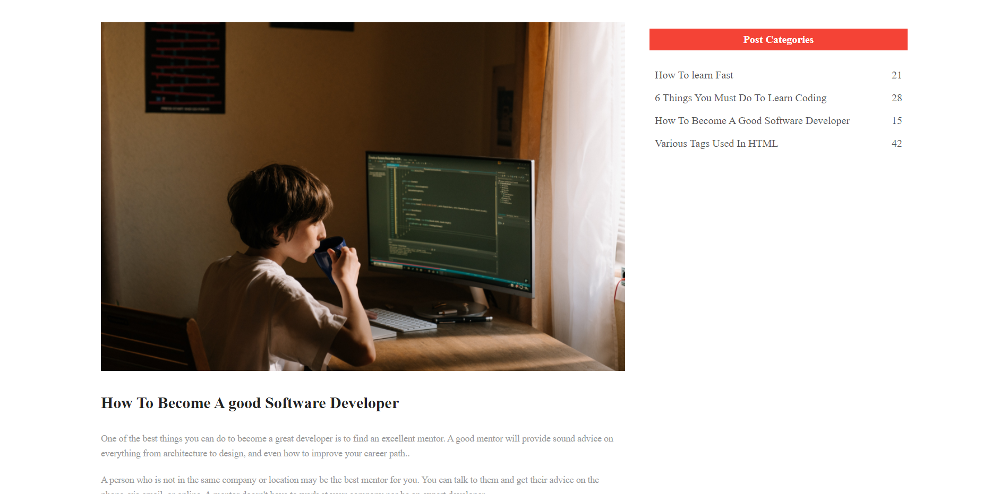
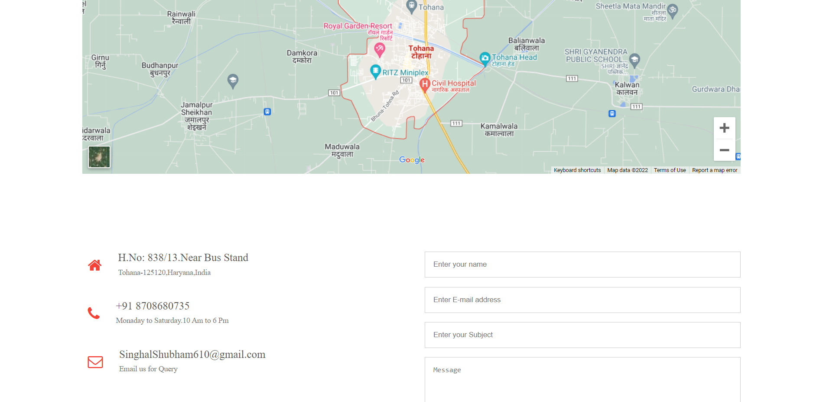

# Web-development-Mini-project
<!-- PROJECT LOGO -->
 

  

  

    <code>A E-Commerce Website for Old Books.The website is also responsive for different devices</code>
     
  

<!-- ABOUT THE PROJECT -->
<h1>🧐 Why this Project</h1>
 
This is a Website where user can buy old books, sell old books, and take old books on rent, there are books of schooling of different classes, colleges books of various courses, and Novels.
<h2 style="text-align:center ; background: black;color: white;">Home page</h2>

  
  
 

 <h2 style="text-align:center ; background: black;color: white;">What We provide</h2>

   

    
    <h2 style="text-align:center ; background: black;color: white;">Books Section</h2>
 
      
        <h2 style="text-align:center ; background: black;color: white;">Feedback Section</h2>
        
          

            <h2 style="text-align:center ; background: black;color: white;">Books Page</h2>
               
  
             
  
               
                <h2 style="text-align:center ; background: black;color: white;">Blog Post page</h2>
            
   
                  
                    <h2 style="text-align:center ; background: black;color: white;">Contact-Us Page</h2>
                  
   
                

  
<h1>🌟 Live link</h1>
  

  
<h1>👨‍💻 Tech stack</h1>

I made this projects using  Tech stacks
* [HTML](https://html.com/)
* [CSS](https://css-tricks.com/)
* [JavaScript](https://JavaScript.com/)

<h1>✍️ Contributing</h1>
Interested in contributing to this project? Thanks so much for your interest! We are always looking for improvements to the project and contributions from open-source developers are greatly appreciated.

<h1>⚠️ License</h1>
The project is free and open-source software licensed under the GNU General Public License v3.0. and distributed under Creative Commons license (CC BY-SA 4.0 International).

 

<h1>💛 @Shubham Singhal</h1>

    
